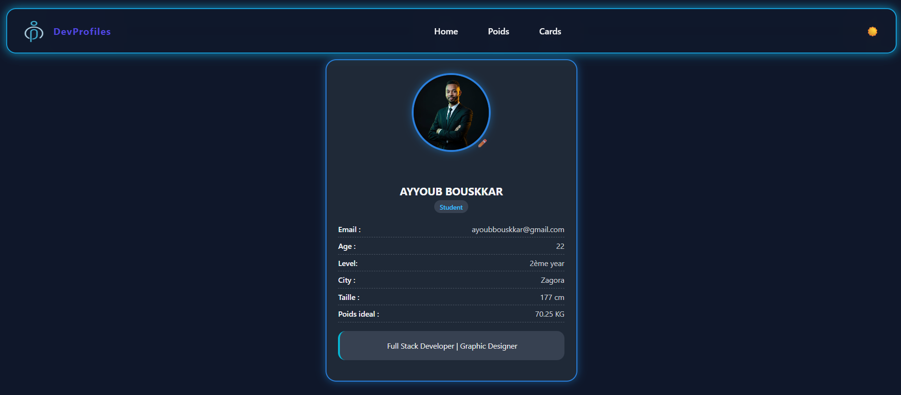

# 🃏 Cards App

A modern and responsive React application that displays interactive cards UI.  
This project is part of my learning journey as a Fullstack Web Developer, focused on building modern and responsive web applications.

---

## 🚀 Live Demo
👉 https://cards-eight-mu-14.vercel.app/

---

## 📸 Preview


---

## 🛠️ Tech Stack
- React.js
- JavaScript (ES6+)
- CSS3
- Git & GitHub
- Vercel (Deployment)

---

## ✨ Features
- Dynamic cards rendering
- Interactive UI components
- Responsive design (mobile-friendly)
- Clean and minimal interface
- Fast and optimized performance

---

## 📦 Installation & Setup

Clone the repository:

```bash
git clone https://github.com/thaliss-bouskkar/cards-app.git
